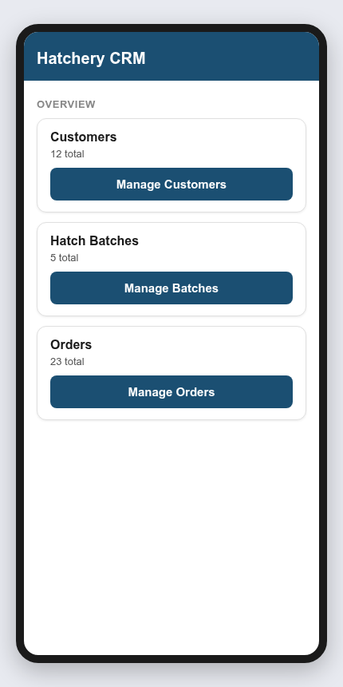
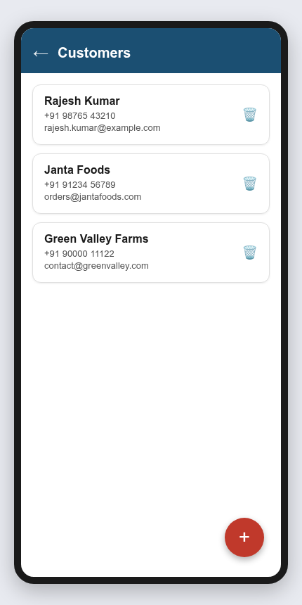
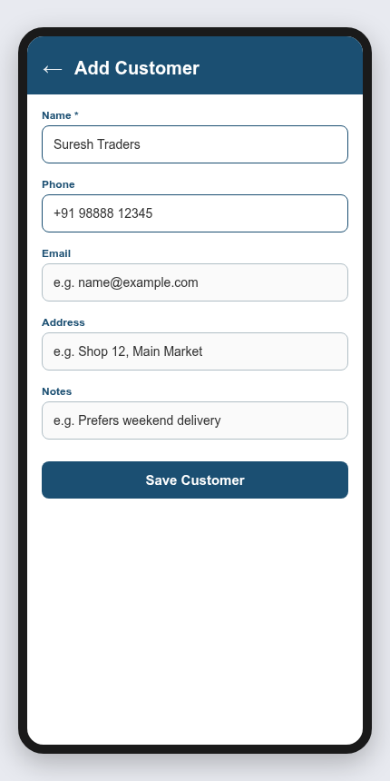
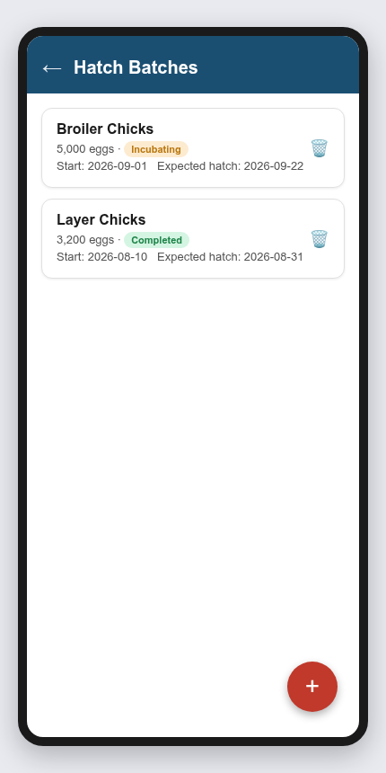
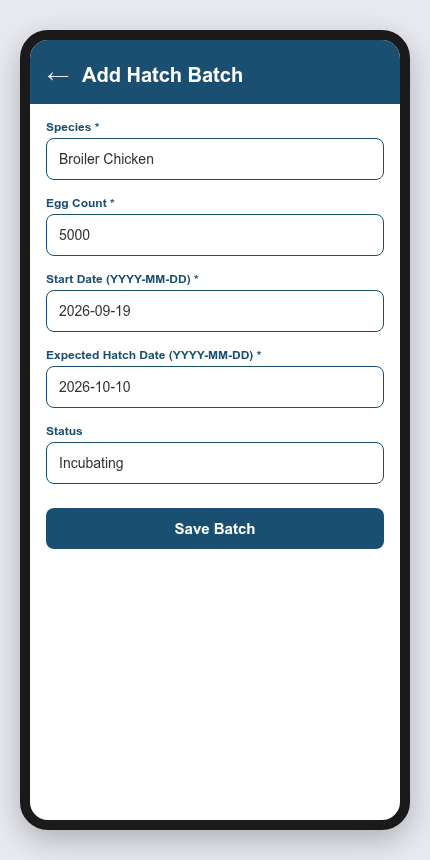
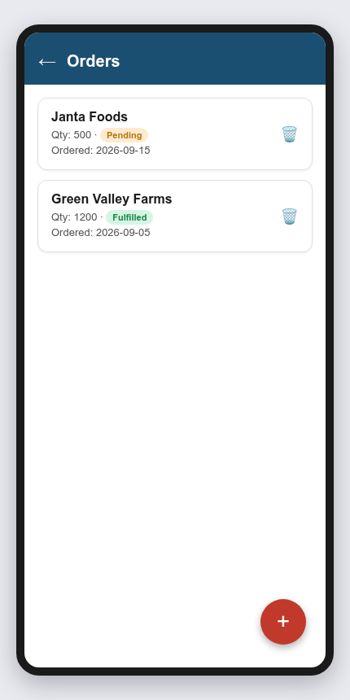
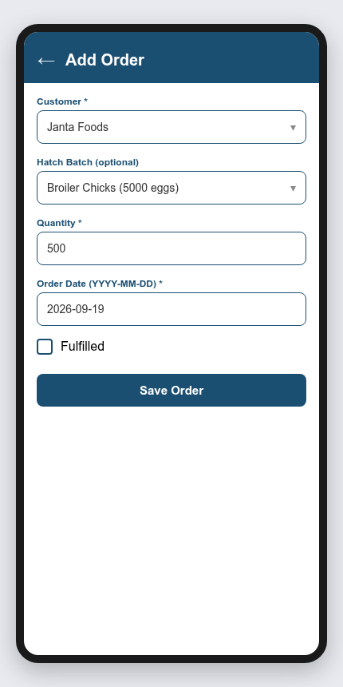

# Hatchery CRM — App Walkthrough (for Customer Review)

This document shows the main screens of the Hatchery CRM app and explains, in plain
language, what each one does and how they connect. Screens shown here are early
mockups meant to confirm the flow and layout before development continues — colors,
sample data, and wording can be adjusted based on your feedback.

See `flow-overview.png` for all 7 screens side-by-side, or view each one individually
in this folder.

---

## 1. Dashboard (Home Screen)

**What it is:** The first screen you see when you open the app.

**What it does:** Gives a quick snapshot of your business — how many customers,
hatch batches, and orders you currently have. Tap any button to go to that section.

---

## 2. Customer List

**What it is:** A list of everyone you do business with (buyers, traders, farms, etc.).

**What it does:** Shows each customer's name, phone, and email at a glance. Tap the
**trash icon** to remove a customer, or tap the **red + button** to add a new one.

---

## 3. Add Customer

**What it is:** A simple form to register a new customer.

**What it does:** You type in the customer's name (required), phone, email, address,
and any notes (e.g. delivery preferences). Tap **Save Customer** to add them to your list.

---

## 4. Hatch Batch List

**What it is:** A list of all egg batches currently being incubated or already hatched.

**What it does:** Shows the species, number of eggs, current status (e.g. Incubating,
Completed), start date, and expected hatch date for each batch — so you always know
what's in progress and when it'll be ready.

---

## 5. Add Hatch Batch

**What it is:** A form to log a new batch of eggs going into incubation.

**What it does:** You enter the species, how many eggs, the start date, the expected
hatch date, and the status. This creates a trackable record for that batch.

---

## 6. Order List

**What it is:** A list of all customer orders.

**What it does:** Shows which customer ordered, how many, whether it's been
**fulfilled** or is still **pending**, and the order date — helpful for tracking
what still needs to be delivered.

---

## 7. Add Order

**What it is:** A form to create a new order for a customer.

**What it does:** You pick the customer from a list, optionally link it to a specific
hatch batch (e.g. "these chicks came from Batch #3"), enter the quantity and order
date, and mark it as fulfilled once delivered.

---

## How it all connects
1. You start on the **Dashboard** and jump into whichever area you need.
2. **Customers** are added once, then reused whenever you create an order for them.
3. **Hatch Batches** track eggs from incubation through to hatching.
4. **Orders** tie a customer to a quantity (and optionally a specific batch), so you
   always know who's getting what and whether it's been delivered.

## What's next
This app will work the same way on **Android phones, iPhones/iPads, and desktop
computers (Windows/Mac/Linux)** — one app, all your devices, keeping your data in sync.

We'd love your feedback on:
- Is anything confusing or missing on these screens?
- Are there other pieces of information you'd want to see per customer/batch/order?
- Any terminology you'd prefer we use instead (e.g. "Batch" vs "Flock")?
